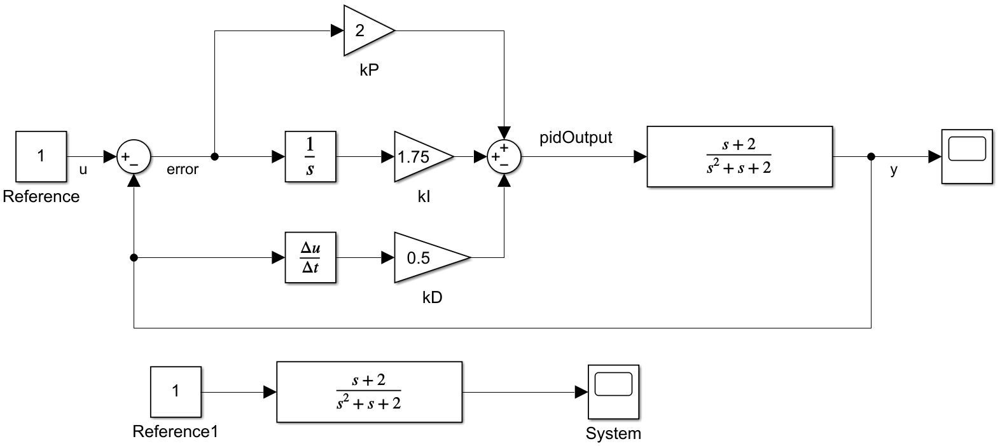
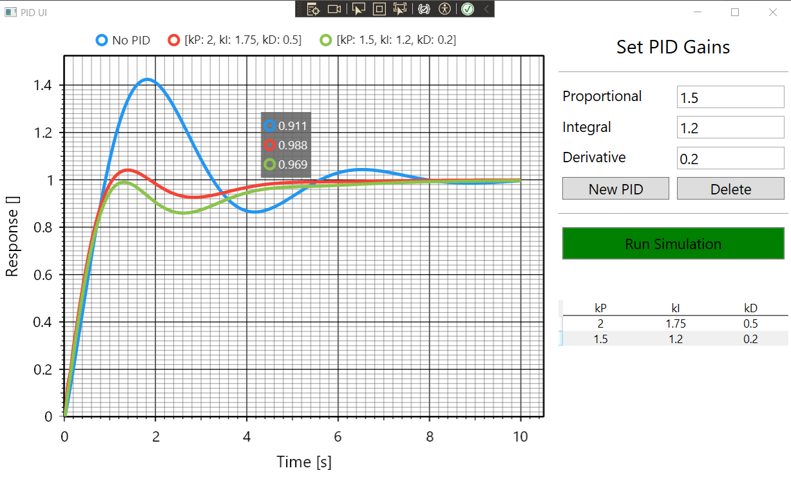

# PID-UI

## Description
A UI made using WPF with C# to plot the results of a Proportional Integral Derivative (PID) controller system with different, selectable PID gains. I created it to test the implementation of a PID controller using C#, for a future project using Unity. The aim was to produce a model that can be used to verify the behaviour of a PID controller, compared with Simulink.

Within Simulink, the following model was produced of a PID controller regulating a transfer function.

Using Inverse Laplace Transforms, an ordinary differential equation can be formed from the transfer function, which allows the ODE to be simulated discretely in C#. This produces the following ODE: 

$\ddot{y} = \dot{u} + 2u - \dot{y} - 2y$

Where $y$ is the output of the system, and $u$ is the input to the system. This can be simulated by stepping through each timestep, approximating derivatives through the Backward Euler method and using these to calculate the acceleration $\ddot{y}$, how the system is evolving through time. Depending on the timestep selected and the complexity of the system, results can differ to the continuous-time simulation provided by Simulink. See the [excellent video by Brian Douglas](https://www.youtube.com/watch?v=nkq4WkX7CFU&t) for more information.

The PID is implemented by default as using the measurement as the source of the derivative term, known as "derivative on measurement". This is to avoid a phenomenon known as derivative kick, where a sudden change in input causes the derivative of the error to be instantaneously large. The PID class has options to change this, allowing for derivative on error, as well as an option for providing the rate of change of the measurement directly to the PID. This is useful for scenarios in which, for example, a system's velocity may be measured by an external sensor and can be utilised within the control.

## Screenshots

